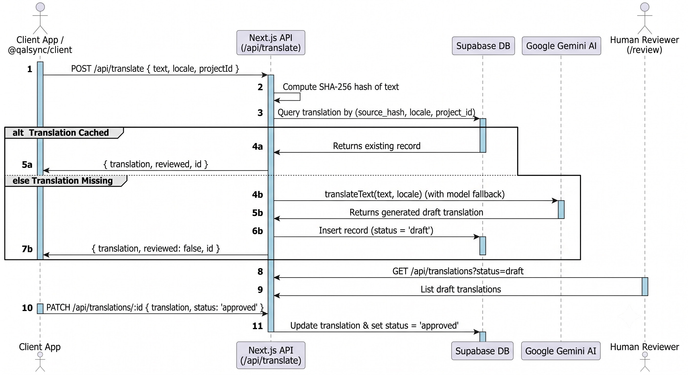

# QalSync

A localization tool for Next.js/React apps, focused on low-resource languages (Amharic, Afaan Oromo) that generic translation services handle poorly. Uses Gemini for initial translations and provides a human review workflow.

## Project Structure

```
/apps/backend       ← Next.js app (API routes + review dashboard)
/packages/client    ← Lightweight npm client library
```

## Architecture & Workflow



## Prerequisites

- Node.js ≥ 18
- [pnpm](https://pnpm.io/) (`npm install -g pnpm`)
- A [Supabase](https://supabase.com/) project
- A [Google AI / Gemini API key](https://aistudio.google.com/apikey)

## Environment Variables

Create `apps/backend/.env.local` with:

```env
SUPABASE_URL=https://your-project.supabase.co
SUPABASE_ANON_KEY=your-anon-key
GEMINI_API_KEY=your-gemini-api-key
```

## Database Setup

1. Go to your Supabase project → SQL Editor.
2. Paste and run the migration file at `apps/backend/supabase/migrations/0001_create_translations.sql`.
3. **Enable email/password auth** in Supabase → Authentication → Providers → Email (it's on by default for new projects).

## Running Locally

```bash
# Install dependencies
pnpm install

# Start the Next.js dev server
pnpm dev
```

The app runs at `http://localhost:3000`.

- **API**: `POST /api/translate`, `GET /api/translations`, `PATCH /api/translations/:id`
- **Review dashboard**: `/review`

## Using the Client Library

```ts
import { translate, translateBatch } from "@qalsync/client";

// Single string translation
const result = await translate("Hello", "am", {
  apiUrl: "http://localhost:3000",
  projectId: "my-project",
});
// → Amharic translation string

// Batch translation
const batchResult = await translateBatch(
  ["Hello", "Goodbye", "Settings"],
  "am",
  {
    apiUrl: "http://localhost:3000",
    projectId: "my-project",
  }
);
// → { "Hello": "ሰላም", "Goodbye": "ደህና ሁን", "Settings": "ማስተካከያዎች" }
```

## Automated Codebase Scanner CLI

Scan `.tsx` and `.jsx` files in any React or Next.js project to automatically extract user-facing UI strings for translation:

```bash
# Scan ./src directory and save strings to qalsync.strings.json
npx qalsync-scan ./src

# Scan AND auto-translate extracted strings via QalSync Batch API
npx qalsync-scan ./src --translate --api-url http://localhost:3000 --project-id my-app --locale am
```

Programmatic usage in Node/TypeScript scripts:

```ts
import { scanProjectStrings } from "@qalsync/client";

const strings = scanProjectStrings("./src");
console.log(`Found ${strings.length} UI strings for localization.`);
```


## API Reference

### `POST /api/translate`

Translate a single string or a batch of strings. Returns cached translations if available, otherwise calls Gemini and saves drafts.

```json
// Single Request
{ "text": "Hello, world!", "locale": "am", "projectId": "my-site" }

// Single Response
{ "translation": "ሰላም ዓለም!", "reviewed": true, "id": "uuid" }

// Batch Request
{ "texts": ["Hello", "Goodbye"], "locale": "am", "projectId": "my-site" }

// Batch Response
{
  "translations": {
    "Hello": { "translation": "ሰላም", "reviewed": true, "id": "uuid-1" },
    "Goodbye": { "translation": "ደህና ሁን", "reviewed": false, "id": "uuid-2" }
  }
}
```


### `GET /api/translations?projectId=...&locale=...&status=draft`

List translations. All query params are optional filters.

### `PATCH /api/translations/:id`

Update a translation and/or approve it.

```json
{ "translation": "Corrected text", "status": "approved" }
```

## Supported Languages

| Code | Language     |
|------|-------------|
| `am` | Amharic (አማርኛ) |
| `om` | Afaan Oromo  |

More languages can be added by extending the prompt in `src/lib/gemini.ts`.
